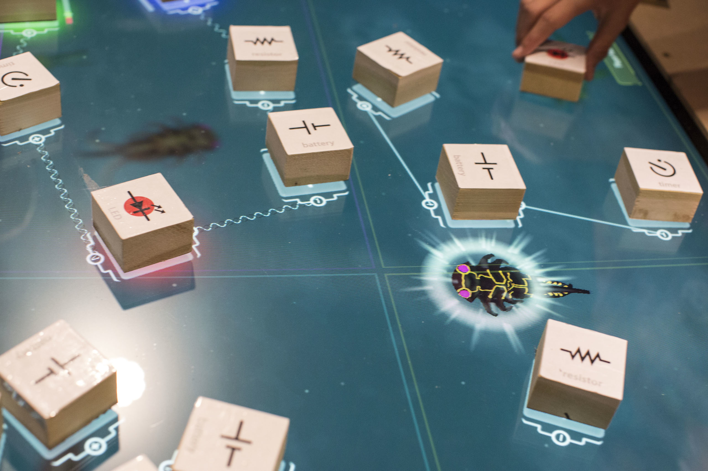

# Analyzing Oztoc Data

In this book we walk you through a short analysis of some actual play data collected from our game: Oztoc.

What is Oztoc?
--------------

An expedition in Mexico reveals an uncharted lagoon teeming with life, and it's up to junior explorers to learn more about its mysteries. Enter Oztoc: an immersive world where children design circuits to lure bioluminescent creatures from the deep.

*Image Credits: Learning Games Network*

The game is a first-of-its kind museum installation, combining a state-of-the-art multitouch tabletop display with tactile physical blocks. The result is a hybrid museum game where students touch physical blocks to create virtual in-game circuits.

*Image Credit: Insider Images/Andrew Kelly*

Oztoc is a Research Environment
-------------------------------

Oztoc is an rich environment for research on how children learn programming and design. Three of its features are key to that research:

1. **Rapid Exploration**: While physical components mean kids can see and touch circuit parts, using virtual wires lets them quickly build, test, and iterate over the circuit prototypes.
2. **In-Game Telemetry**: Oztoc is built on the [ADAGE](http://adageapi.org) framework, which lets us collect deep information in real-time on children's play behavior
3. **Multiple Views**: The museum installation itself is instrumented with multiple video cameras to get a complete view of the action at the table. By coordinating ADAGE telemetry data with video of how students play, Oztoc represents a first-of-its-kind opportunity to understand design-based learning in a museum setting.

Oztoc is a Partnership
------------------------------------

Oztoc is a National Science Foundation funded collaboration between the [Games+Learning+Society Group](http://gameslearningsociety.org/) at the University of Wisconsin-Madison, [The New York Hall of Science (NYSCI)](http://nysci.org/), and the [Learning Games Network](http://learninggamesnetwork.org/). Co-led by Principal Investigators [Leilah Lyons](http://www.cs.uic.edu/~llyons/) (NYSCI) and [Matthew Berland](http://gameslearningsociety.org/bio_matthew.php) (UW-Madison), the project team combines learning science researchers, game designers, and museum specialists.

# What kinds of data do we collect?

Using the [ADAGE](http://adageapi.org/) framework, we're able to log discrete events as they happen in the game. In this test case analysis, we'll mainly be concerned with with events that happen when players connect and disconnect circuit components.

