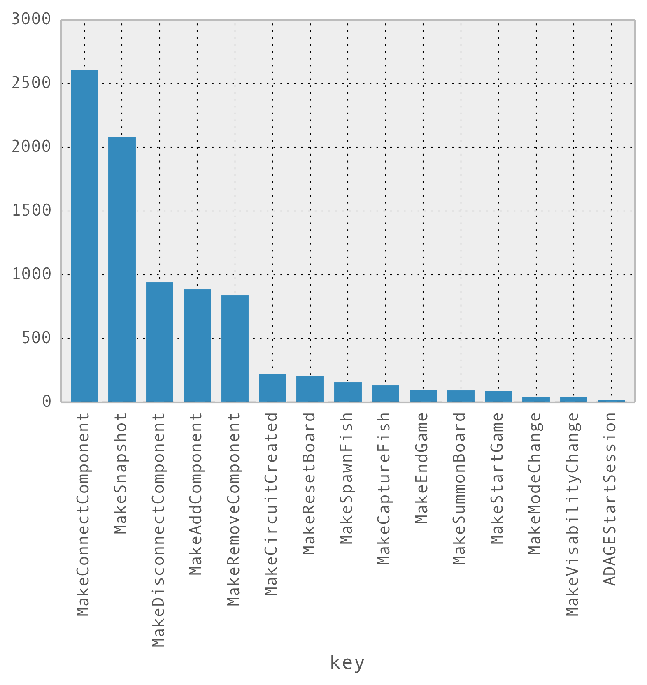

# Exploring Events by Type

One of the first questions I had for our data was:

### What Does the Distribution of Event Types Look Like?

First, I'm going to show the Python code I used to get a table of event counts by type. Then, I'm going to explain why the code looks the way it does. (Also, please note that I am not a perfect programmer, so this may not be the *best* way, but it is *a* way.)

```python
ms.groupby('key').count().sort(columns=['timestamp'], ascending=False)[timestamp]
```

<table>
<colgroup>
<col style="text-align:left;"/>
<col style="text-align:left;"/>
</colgroup>

<thead>
<tr>
	<th style="text-align:left;">key</th>
	<th style="text-align:left;">timestamp</th>
</tr>
</thead>

<tbody>
<tr>
	<td style="text-align:left;">MakeConnectComponent</td>
	<td style="text-align:left;">2609</td>
</tr>
<tr>
	<td style="text-align:left;">MakeSnapshot</td>
	<td style="text-align:left;">2086</td>
</tr>
<tr>
	<td style="text-align:left;">MakeDisconnectComponent</td>
	<td style="text-align:left;">943</td>
</tr>
<tr>
	<td style="text-align:left;">MakeAddComponent</td>
	<td style="text-align:left;">891</td>
</tr>
<tr>
	<td style="text-align:left;">MakeRemoveComponent</td>
	<td style="text-align:left;">840</td>
</tr>
<tr>
	<td style="text-align:left;">MakeCircuitCreated</td>
	<td style="text-align:left;">229</td>
</tr>
<tr>
	<td style="text-align:left;">MakeResetBoard</td>
	<td style="text-align:left;">211</td>
</tr>
<tr>
	<td style="text-align:left;">MakeSpawnFish</td>
	<td style="text-align:left;">161</td>
</tr>
<tr>
	<td style="text-align:left;">MakeCaptureFish</td>
	<td style="text-align:left;">136</td>
</tr>
<tr>
	<td style="text-align:left;">MakeEndGame</td>
	<td style="text-align:left;">100</td>
</tr>
<tr>
	<td style="text-align:left;">MakeSummonBoard</td>
	<td style="text-align:left;">96</td>
</tr>
<tr>
	<td style="text-align:left;">MakeStartGame</td>
	<td style="text-align:left;">92</td>
</tr>
<tr>
	<td style="text-align:left;">MakeModeChange</td>
	<td style="text-align:left;">45</td>
</tr>
<tr>
	<td style="text-align:left;">MakeVisabilityChange</td>
	<td style="text-align:left;">43</td>
</tr>
<tr>
	<td style="text-align:left;">ADAGEStartSession</td>
	<td style="text-align:left;">23</td>
</tr>
</tbody>
</table>

Two things to note here. First, in the table above the numbers are *counts*. It's slightly confusing because the column title you'll get in output will be `timestamp` in our case, but what pandas is reporting is the number of `timestamp` events that match each key type in the left-hand column.

Second, I'm using a pattern of programming called [method chaining](http://en.wikipedia.org/wiki/Method_chaining), which is a [common practice](https://github.com/mbostock/d3/wiki/Gallery) in other programming frameworks such as [d3](http://d3js.org/). In short, `ms` is a dataframe object, when I call methods on it, those methods may return other objects which *also* have methods I might want to call in sequence. So, the `groupby()` function takes `ms` as input, returns a grouped dataframe, and passes that grouped dataframe as input to `.count()`. Another way of thinking of method chaining is that `a.b().c()` can be understand as the function composition $c(b(a))$.

So, let's break down my line of code from left to right:

```python
ms.groupby('key').count().sort(columns=['timestamp'], ascending=False)[timestamp]
```

- `ms` - take the `ms` dataframe, then
- `groupby('key')` - group its data by key, then
- `count()` - count the number of data items in each group, then
- `sort()` the data, in *descending* order, according to the count in the `timestamp` column, and finally
- `[timestamp]` selects just the `timestamp` column

It seems like one big ol' line of code, but it's actually a complex stepwise procedure that I got to express in a compact way because of [method chaining](http://en.wikipedia.org/wiki/Method_chaining).

### Visualizing Events by Type

Now, if we'd prefer to *visualize* our data, we can actually do so quite easily. Here, we'll make a bar chart of the types of events in our data and how many of each type are in the dataset:

```python
msdata = ms.groupby('key').count().sort(columns=['timestamp'], ascending=False)
p = msdata['timestamp'].plot(kind='bar')
print(p)
```



### Houston, We Have a Problem

A big one. Continue on to the next section to see why this bar chart is bad news.

