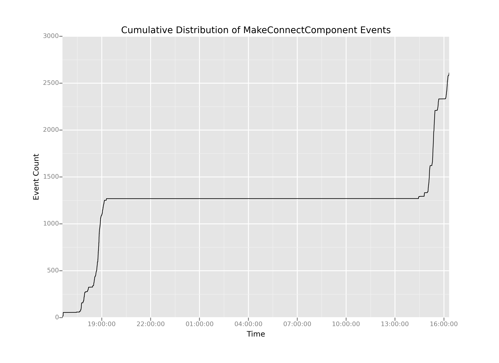

# Visualizing Events Over Time

So, it seems like we have way too many `MakeConnectComponent` events. Earlier, I explained that we're *averaging* more than one `MakeConnectComponent` event per second. But what if we wanted to think about whether that average really describes a typical time slice of our data? In other words, we might want to know how our `MakeConnectcomponent` events are distributed over time.

One way to think about that distribution is to ask: *when do our `MakeConnectComponent` events occur over time?* Below, I'm going to use the `ggplot` package to look at the cumulative distribution of the connection events. The syntax may seem wonky and complicated at first, but it's actually an elegant implementation of [ggplot2](http://docs.ggplot2.org/0.9.3.1/index.html), itself an implementation of Leland Wilkinson's [Grammar of Graphics](http://www.amazon.com/Grammar-Graphics-Statistics-Computing-ebook/dp/B003XQF3TQ/ref=sr_1_1?ie=UTF8&qid=1401707640&sr=8-1&keywords=grammar+of+graphics). If at first you're stymied by it, don't worry. I'll try to help break it down for you.

First, we're doing some basic manipulation to get a cumulative sum column. This is actually so dumb I'm almost embarrased. I create a column by applying a [lambda function](http://www.diveintopython.net/power_of_introspection/lambda_functions.html) to the `timestamp` column that *always* returns 1, then I just sum cumulatively over that column. Lastly, I apply another [lambda function](http://www.diveintopython.net/power_of_introspection/lambda_functions.html) to format our timestamp (currently an integer) into a nicer-formatted timestamp.

I'll break these plotting lines down one major line at a time:

1. I create a `ggplot` object, which is essentially the basic kind of object from whence all plots are constructed in ggplot. `aes()` just stands for *aes*thetic mapping, where I'm telling ggplot how to map data to graphical features. In this case, I'm saying "map the values in the `timestamp1` column to the x position of this plot, and map the values of `cumulativeCount` to the y position. It may seem trivial now, but the power of aesthetic mappings like this is that I can also map quantities (or categories) to other graphical properties, for example mapping other columns in my dataframe to the aesthetic properties of color or shape. For now, we'll just stick with mapping quantities to cartesian x and y coordinates. When creating the `ggplot` object, I also tell it what dataframe I'm talking about, so the local names of `timestamp1` and `cumulativeCount` make sense in scope.
2. What we see now is a common pattern in ggplot-style programming. I can literally *add* a layer to my plot using the plus operator. Here, I'm telling ggplot that I want it to apply my chosen aesthetic mappings using a line geometry, which means it will connect each discrete datapoint with a line. (An alternative geometry would have been a simple *point* geometry, `geom_point()`, which would give us a bivariate scatterplot instead of a lineplot.
3. The remaining lines add special options to my plot using the same compositional syntax of the plus operator. Here, I'm using special functions `ggtitle()`, `xlab()`, and `ylab()` to set the text for the plot title and axis labels.
4. Next I just use a simple `print()` call to make sure my plot shows up in my interactive session.
5. Finally, I use a convenience function called `ggsave()` to save my plot directly to a file. `ggsave()` is smart and it detects the desired type of output file based on the suffix you pass in as a filename. In this case I'm using the .PNG format for images, but if I wanted an infinitely scalable image I could have used a .PDF extension.

```python
# Manipulating the data to get a cumulative sum
# and nicely formatted timestamps
connectionEvents = ms[ms.key == 'MakeConnectComponent']
connectionEvents['cumulativeCount'] = connectionEvents.timestamp.apply(lambda x: 1).cumsum()
connectionEvents['timestamp1'] = connectionEvents.timestamp.apply(lambda x: pd.Timestamp(x, unit='ms'))

# Creating the basic plot
p = ggplot(aes(x='timestamp1',
               y='cumulativeCount'),
           data=connectionEvents)
p = p + geom_line()
p = p + ggtitle('Cumulative Distribution of MakeConnectComponent Events')
p = p + xlab('Time')
p = p + ylab('Event Count')

# Showing the plot
print(p)

# Saving the plot
ggsave(plot=p,
       filename='cumulativeDistributionOfMakeConnectComponent1.png')
```


