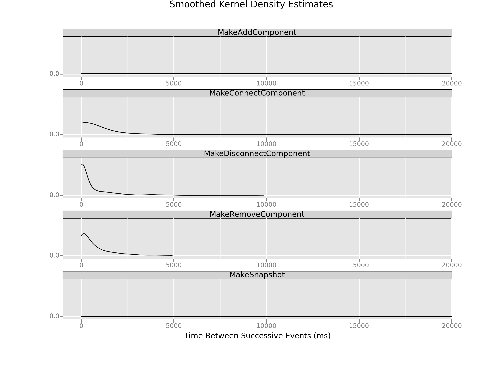

# Visualizing Time Deltas

So, we know the *distribution* of `MakeConnectComponent` events is uneven. We know that because in the [last section](working_with_time_deltas.html) we plotted the cumulative distribution function and saw it had a widely variable slope. What I'd like to do now is get an idea of just what that distribution of elapsed event times looks like.

To do that, we're going to use a visualization called a [kernel density estimate](http://en.wikipedia.org/wiki/Kernel_density_estimate). Essentially, what we're doing is creating a smoothed empirical approximation of what the distributions of events look like.

We're also going to use another powerful feature of graphical analysis: what statistician [Bill Cleveland](http://cm.bell-labs.com/cm/ms/departments/sia/wsc/) and [Edward Tufte](http://www.amazon.com/The-Visual-Display-Quantitative-Information/dp/0961392142/ref=sr_1_1?ie=UTF8&qid=1401770677&sr=8-1&keywords=visual+display+of+quantitative+information) call "[small multiples](http://www.juiceanalytics.com/writing/better-know-visualization-small-multiples)." We're actually going to take a look at the distributions of time deltas for the top 5 most frequent kinds of events and graphically compare them. And, we'll plot them all on the same scales using a ggplot feature called `facet_wrap()`.

```python
topFive = loadDataSortedByTimestamp(filepath)
topFiveMostFrequentEvents = list(ms.groupby('key').count().sort(columns=['timestamp']).index)[-5:]
frequencyFilter = topFive.key.apply(lambda x: x in topFiveMostFrequentEvents)
topFive['delta1'] = topFive.timestamp.diff()
topFive = topFive[frequencyFilter]


p = ggplot(aes(x = 'delta1',
               group='key'),
           data=topFive)
p = p + geom_density() # a Kernel Density Estimate
p = p + scale_x_continuous(limits=[-1000, 20000])
p = p + facet_wrap(y='key',
                   ncol=1,
                   scales='fixed')
p = p + xlab('Time Between Successive Events (ms)')
p = p + ggtitle('Smoothed Kernel Density Estimates')

print(p)
ggsave(plot=p,
       filename='kernelDensityEstimate1.png')
```



Two features stand out when we look at this set of small multiples. First, there is a huge variation in the shapes of the distributions themselves. `MakeSnapshot` and `MakeAddComponent` are almost completely flat. The other distributions, meanwhile, have most of their bulk concentrated in short time intervals.

Second, if we look closely, it might be the case most of the `MakeConnectComponent` events occur within a short duration of one another, because that distribution has much of its meat in about the 1000ms (or 1s) delta range. Now, it's hard to tell because of the scale—`MakeDisconnectComponent` looks much sharper and seems to hug closer to 0 on the x-axis—but remember there are many, many more `MakeComponentEvents`.

So, just what does the breakdown of those connection events look like? Let's create a histogram to find out. What I'll do is define bins of time according to which we can group events, and we'll see what an approximation of these distributions looks like when we plot them all on the same graph.

```python
binBreaks = [0, 50, 100, 200, 300, 400, 500, 600, 700, 800, 900, 1000]
connections = loa

p = ggplot(aes(x='delta1',
               fill='key'),
           data=topFive) + \
        geom_histogram(breaks=binBreaks) + \
        scale_x_continuous(breaks=binBreaks) + \
        ggtitle('Distribution of Time Deltas Between Successive Events') + \
        ylab('Number of Events') + \
        xlab('Time Between Events (ms)')
print(p)
ggsave(plot=p,
       filename='histogram2.png')
```


This plot is our smoking gun, and I'll explain why. Remember, what we've done is

- Take only the `MakeConnectComponent` events;
- Use `diff()` to compute the *time deltas* (`diff1`), the amount of time that passes between one `MakeComponentConnect` event and the next;
- Arrange those time deltas in bins according to how large thed deltas are.

Every time a time delta goes in a bin, the stack for that bin gets a little bit higher. The highest stack in this plot, by an obscene margin, is the stack of deltas that represent 50ms or fewer passing between successive `MakeConnectComponent` events.

Let's put that another way. This histogram's x axis goes from 0ms to 1000ms in time deltas, which means it plots about 1744 of the total 2609 `MakeConnectComponent` events:

```python
len(connections[connections.delta1 <= 1000]) # 1744 events
```

Of those `MakeConnectComponent` events, *more than 1,000* happened within 50ms of one another. 50ms represents a frequency of 20 times per second (20Hz), or 1200 times per minute. If human children were banging blocks together at a frequency of about 20Hz, we would have noticed. Further still, the events plotted here represent about 67% of the total connection events. So, that means more than 2/3 of the connection events we recorded happened within 1 second or less of one another, with more than 50% of *those* events happening at what's essentially an inhuman frequency of 20Hz.

It's clear that whatever's happening in our data, most of the connection events we're recording *aren't* deliberate connections made by the players. It seems almost certainly the case that something is causing our system to record false connections events, and lots of them. What remains is to figure out what that something is.
