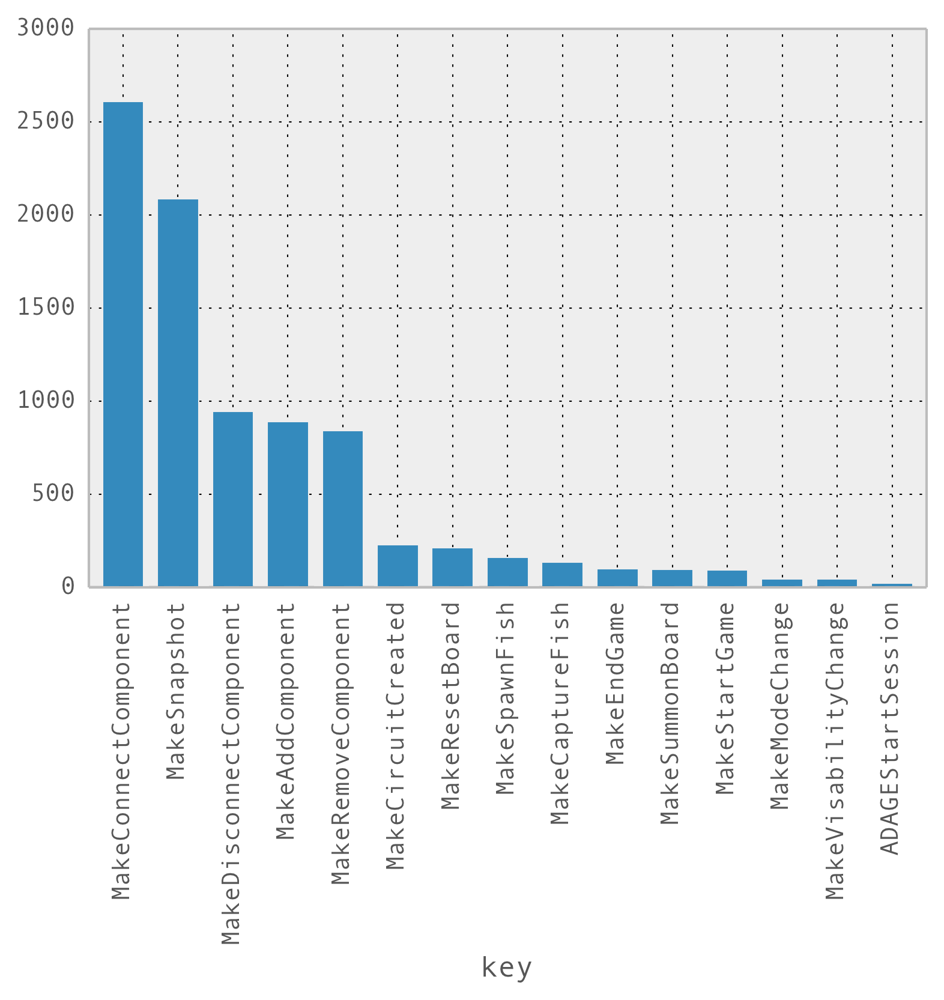

# Why Are There So Many MakeConnectComponent Events?

I mentioned in the last section that there's a huge problem with our data. Let's take a look again at the counts of different types of events, but this time we'll focus on the top five most frequent events:

```python
topFiveMostFrequentEvents = ms.groupby('key').count().sort(columns=['timestamp'], ascending=False)[:5]
topFiveMostFrequentEvents['timestamp']
```

<table>
<colgroup>
<col style="text-align:left;"/>
<col style="text-align:right;"/>
</colgroup>

<thead>
<tr>
    <th style="text-align:left;">key</th>
    <th style="text-align:right;">count</th>
</tr>
</thead>

<tbody>
<tr>
    <td style="text-align:left;">MakeConnectComponent</td>
    <td style="text-align:right;">2609</td>
</tr>
<tr>
    <td style="text-align:left;">MakeSnapshot</td>
    <td style="text-align:right;">2086</td>
</tr>
<tr>
    <td style="text-align:left;">MakeDisconnectComponent</td>
    <td style="text-align:right;">943</td>
</tr>
<tr>
    <td style="text-align:left;">MakeAddComponent</td>
    <td style="text-align:right;">891</td>
</tr>
<tr>
    <td style="text-align:left;">MakeRemoveComponent</td>
    <td style="text-align:right;">840 </td>
</tr>
</tbody>
</table>

In our implementation of events, `MakeConnectComponent` should be triggered once the system detects that two circuit elements have become connected (say, when a player bumps a resistor and a battery together). `MakeDisconnectComponent` should be triggered once the system detects that two connected elements have become disconnected (say, when a player swipes a finger across a wire to cut it.)

That leads to Problem 1

### Problem 1 - There are more connect events than there are disconnect events

And not just a few more, *way* more. Almost three times more.

$$\frac{connects}{disconnects} = \frac{2609}{943} \approx 2.77$$

If you think about it, this doesn't make sense at all.

In our game, each block has a lone positive terminal and a lone negative terminal. And, each terminal only accepts a maximum of one connection for simplicity. When players add blocks to the table, the blocks don't start as being not connected to anything. The first `MakeConnectComponent` event *should* happen when two free terminals from two different blocks get bumped together. And, if two terminals are connected, they can't get connected to other things without getting disconnected first. So, we should expect at least something close to parity: there should be about as many disconnect events as there are connect events. Otherwise, how can a bunch of connected terminals keep connecting to other things? (Again, remember that each terminal should accept a maximum of one connection.)

So, that's pretty weird. Also, possibly very bad. But, it gets even worse when you consider Problem 2.

### Problem 2 - There are more connect events than there are snapshot events

In our game, we built an event called `MakeSnapshot` that takes a snapshot of the entire state of the board at regular intervals. We did that because we knew not all actions in the game should generate events. For example, if we recorded every single time any block changed its position, that would be *way* too much data. On the other hand, we need to know when players move blocks even if those movements don't generate big game events (like completing a circuit). So, we compromised. Every second, the game stores a snapshot of information about the state of the board, and that event is called `MakeSnapshot`.

If you look at the table above or this barchart, you'll notice that `MakeSnapshot` comes in second in our Top 5 Most Frequent Events. And, it's not a small margin, either. `MakeConnectComponent` is beating it by 25%. That is a Very Weird Thing.



If we assume that the snapshots are reliably firing every second, that means that *on average, the system is registering block-to-block connections more than once per second.* If all that data were user-generated, that means that over a period of about 44 total minutes of gameplay, kids were connecting blocks at a rate of *more than one block per second, every second* for the entirety of the 44 minutes.

To put that in perspective one more way:

- If you played [The Lion Sleeps Tonight (Wimoweh)](https://www.youtube.com/watch?v=cU-eAzNp5Hw) by The Tokens;
- On repeat;
- **17** consecutive times;
- And you snapped your fingers to the beat (60bpm) the entire time;
- **Each snap** would represent two circuit elements being connected;
- For **44** non-stop, consecutive minutes

Rather than assuming children are connecting circuit elements at a ludicrously high rate (Problem 2), which also would seem physically impossible (Problem 1), it seems more likely that there's a problem with the game's data logging that's revealed by our data. So, let's go to the next section and explore a method for checking it out using time deltas.
