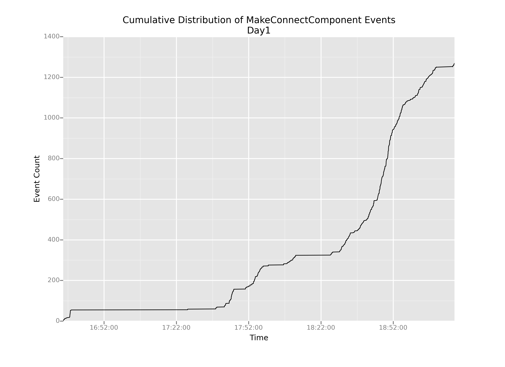
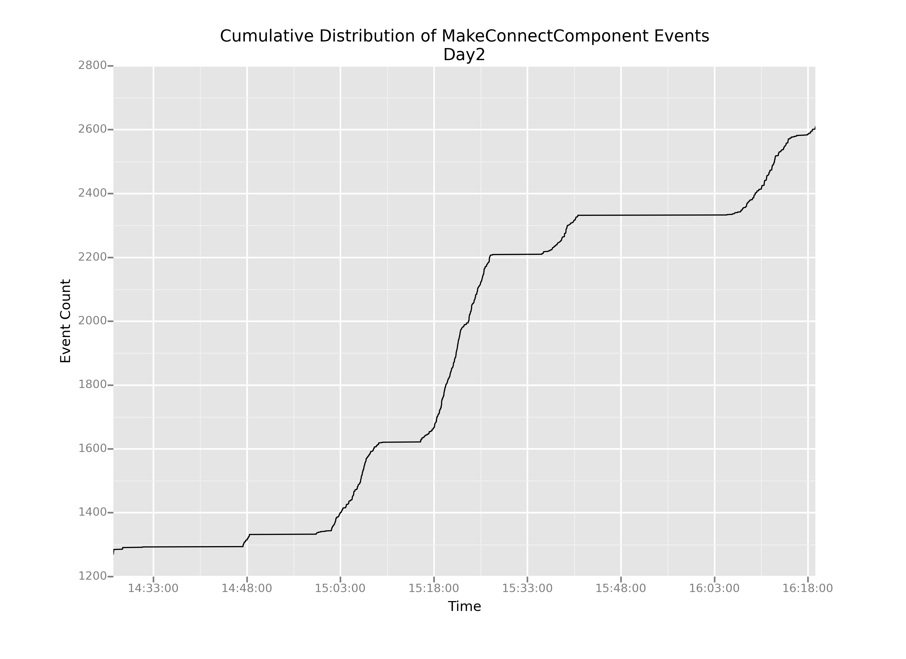

# Working with Time Deltas

We're going to compute the time difference between successive events, which I'm calling *time deltas*. It's worth taking a second to think about how the delta is defined:

For the $i$th event, the $\Delta$ value is given by the simple equation below, where $t_i$ is the timestamp of the $i$th event:

$$\Delta = t_i - t_{i-1}$$

As a result, the very first event $(i = 0)$ in a series will have a diff value of `NaN` or `NaT` (Not a Time), because the -1st event is undefined. But the second event will have a diff value of (Time of Second event - Time of First event). The very last event will also have a value: (Time of Last event - Time of Penultimate event).

The handy thing about pandas is that every data series (and a column counts as data series) has a `diff()` method, which does exactly what we want: it computes successive pairwise differences between events. If we apply the `.diff()` function to our timestamps, we'll have exactly what we want: a column of numbers where each number represents the time elapsed since the event that came before.

```python
connectionEvents['delta1'] = connectionEvents.timestamp1.diff()
```

And, now that we have our column of deltas, how can we figure out where the big boring part starts? Well, the big boring part lasts a long time: multiple hours. So, what we're looking for is a huge time delta. Say a delta of more than five hours.

```python
connectionEvents[connectionEvents.delta1 > np.timedelta64(5, 'h')]['timestamp']
```

```
4443    1400077592798
Name: timestamp, dtype: int64
```

Bingo! Event 4443 marks the finale of the long boring stretch. Now we can create two subsets of data, which I'll call `day1` and `day2`, plot them separately, and cut out that big giant flatline from our original plot.

```python
whenBoringPartEnds = 1400077592798
day1 = connectionEvents[connectionEvents.timestamp < whenBoringPartEnds]
day2 = connectionEvents[connectionEvents.timestamp >= whenBoringPartEnds]

# Creating the day1 plot
p = ggplot(aes(x='timestamp1',
               y='cumulativeCount'),
           data=day1)
p = p + geom_line()
p = p + ggtitle('Cumulative Distribution of MakeConnectComponent Events')
p = p + xlab('Time')
p = p + ylab('Event Count')

# Showing the plot
print(p)

# Saving the plot
ggsave(plot=p,
       filename='cumulativeDistributionDay1.png')

# Creating the day2 plot
p = ggplot(aes(x='timestamp1',
               y='cumulativeCount'),
           data=day2)
p = p + geom_line()
p = p + ggtitle('Cumulative Distribution of MakeConnectComponent Events')
p = p + xlab('Time')
p = p + ylab('Event Count')

# Showing the plot
print(p)

# Saving the plot
ggsave(plot=p,
       filename='cumulativeDistributionDay2.png')
```





OK, this is helpful. We can definitely see that even after we cut out the boring parts, the slope of this cumulative distribution varies pretty wildly over time: there are really steep parts and really shallow parts.

But now my question is: how do we understand that change in slope? It stands to reason that in regions of shallow slope, there are probably very few events happening overall. But what about the steep parts? How can we understand what's causing such sharp increases in the graph?

The most pertinent question for us—as game designers right now—is: **are those steep-sloped regions caused by kids actually connecting blocks, or by something else?**
